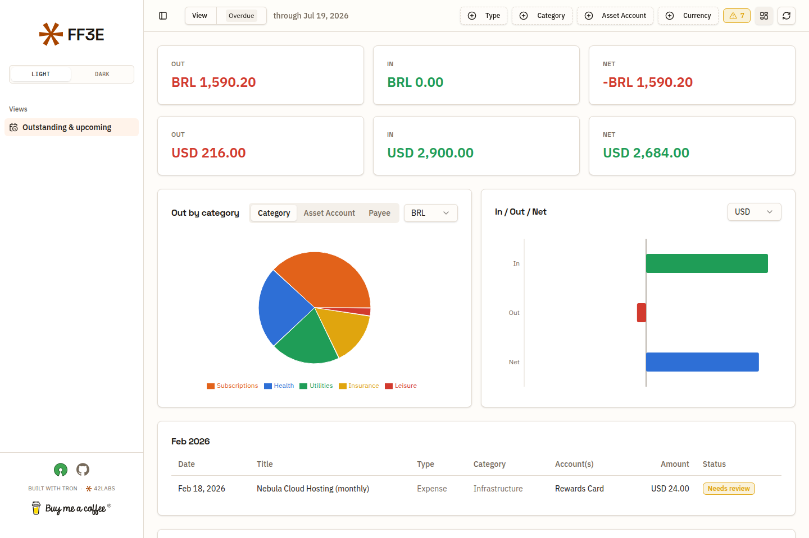

# Entropy for Firefly III



**[Live demo →](https://ff3e.42labs.io)** — 100% synthetic data, no Firefly III instance behind it.

**What's coming, and whether it actually happened.**

Firefly III knows all your recurring transactions — rent, salary, that streaming
subscription. But it won't lay them out in front of you and tell you which ones
have already landed and which are quietly overdue.

Entropy for Firefly III does exactly that, and nothing else. It's a read-only **Forecast**
view: point it at your Firefly III, and it projects every recurring transaction
forward, then matches each expected occurrence against your real booked
transactions.

Every occurrence ends up in one of five states:

| Status | Meaning |
| --- | --- |
| **Upcoming** | Due in the future. Nothing to do yet. |
| **Paid** | An expense that's been booked. |
| **Received** | Income that's arrived. |
| **Done** | A transfer that went through. |
| **Needs review** | Its date has passed and no matching transaction turned up. |

That last one is the point of the whole thing. Entropy for Firefly III never guesses: if it
can't find a real transaction with the same type, the same exact amount, on the
same account, within a few days of the expected date, it says so instead of
pretending.

## What you see

- **Day / Month / Year** — one period at a time, with a picker to jump anywhere.
- **Outstanding** — everything unconfirmed and already due, including the months
  behind you.
- **Due by Month-End** — the same, plus what's still ahead this month.
- Filter by type, category, **asset account** or currency; totals never
  cross-sum currencies. (The account facet lists only your own asset accounts —
  the paying/receiving side — never expense or revenue counterparties.)

## Run it

You need a Firefly III instance and a Personal Access Token
(*Options → Profile → OAuth → Personal Access Tokens*).

```bash
git clone https://github.com/4242labs/ff3e.git
cd ff3e
cp .env.example .env      # add your FIREFLY_III_URL and FIREFLY_III_TOKEN
docker compose up
```

Then open <http://localhost:8000>.

## How it fits together

```
browser ──▶ Entropy server ──▶ Firefly III REST API
  (SPA)     (forecast engine)   (your data, untouched)
```

The server exists for one reason: Firefly III authenticates with a token that
must never live in browser code, and it doesn't send CORS headers — so the
browser can't call it directly. The Entropy server holds the token, reads, and
hands back JSON. **It writes nothing back to Firefly III.** Your recurring
transactions can stay paused; they'll never auto-post because of this.

The entire Firefly III coupling is two functions in `server/forecast.py` —
`fetch_recurrences()` and `fetch_transactions()`. Everything else is
ledger-agnostic.

## Develop

```bash
# server
cd server && pip install -r requirements.txt
FIREFLY_III_URL=... FIREFLY_III_TOKEN=... uvicorn main:app --reload

# web (proxies /api to :8000; falls back to synthetic fixtures if nothing's there)
cd web && npm install && npm run dev
```

Vite · React · TypeScript · Tailwind v4 · shadcn/ui · Recharts.
Fixtures in `web/src/fixtures/` are synthetic — no real financial data.

`npm run build:demo` builds a fully static bundle with no server dependency:
`fetchForecast` short-circuits straight to the fixtures, so the demo works
from a plain static host (this is what powers the GitHub Pages demo above).
`web/src/fixtures/projections-demo-story.json` is the fixture behind it — a
hand-written, entirely fictional forecast with an overdue backlog, a couple
of needs-review items, and both income and expenses, so a first-time visitor
sees the product's whole point without connecting anything.

## Configuration

| Variable | Default | |
| --- | --- | --- |
| `FIREFLY_III_URL` | — | Your instance, no trailing slash. **Required.** |
| `FIREFLY_III_TOKEN` | — | Personal Access Token. **Required.** |
| `MATCH_DAYS` | `5` | How far either side of the expected date a real transaction still counts as a match. |
| `FIREFLY_CF_ACCESS_CLIENT_ID` | — | Optional. Set both CF-Access vars if your Firefly III sits behind a Cloudflare Access service token; the pair is added as request headers. Unset → not sent. |
| `FIREFLY_CF_ACCESS_CLIENT_SECRET` | — | Optional. See above. |
| `PORT` | `8000` | Host port. |

### Consuming this as a downstream app

You can run this repo **unmodified** and mount it inside another app (behind your own auth, under a
subpath) purely via build-time flags — no fork needed. Set these when running `npm run build` in `web/`:

| Build flag | Default | |
| --- | --- | --- |
| `VITE_BASE` | `./` | Public base path when the SPA is mounted under a subpath, e.g. `/entropy/`. |
| `VITE_API_BASE` | `api/forecast` | The forecast endpoint the SPA calls (override if you proxy it elsewhere, e.g. `/projections/data`). |
| `VITE_AUTH_RELOAD` | off | Set to `1` when the server sits behind an auth proxy (e.g. Cloudflare Access): an expired session (opaque redirect / non-JSON) triggers a one-shot reload to re-authenticate instead of a stuck error. |

## License

Open source — [AGPL-3.0](LICENSE). Commercial — contact ahoy@42labs.io.
Both, in full: [LICENSING.md](LICENSING.md).

---
Built by [42labs](https://github.com/4242labs). Not affiliated with
[Firefly III](https://github.com/firefly-iii/firefly-iii).

---
If it earned its keep, [coffee is appreciated](https://buymeacoffee.com/42piratas). ☕
